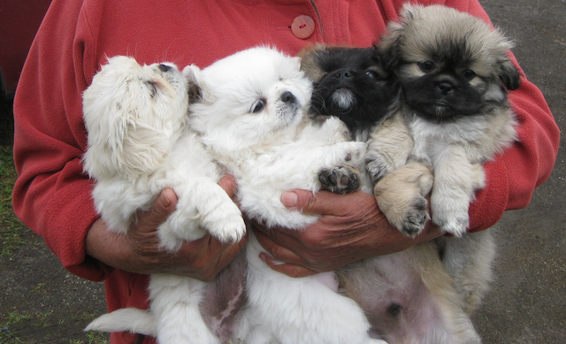

Title: Hypocrisy of most vegetarians
Date: 2015-11-03 00:00
Tags: ethics

Most vegetarians claim to love animals, and many of them own pets. Having pets, I believe, goes against the vegetarian ideology. We want to avoid animal suffering yet we cause more animal suffering by choosing animal company.

## Pets are not vegetarian

The second and third most common household pets in the US are cats and dogs. Cat food is mostly fish based, since cats are [obligate carnivore](https://en.wikipedia.org/wiki/Carnivore#Obligate_carnivores). Similar for [dog food](https://en.wikipedia.org/wiki/Dog_food#Commercial_dog_food), which is mostly based on meat and animal by-proucts.

I see being a vegetarian and owning pets as conflicting since:

- Pet food is mostly based on other animal products
- These other animals also suffer (or their ecosystems are depleted in the process)
- Pet food can (and often does) contain "unusable or undesirable" materials which affect the wellbeing of pets
- All animals involved (pets and pet food) suffer in the process 

## Overpopulation of pets

There is also the issue of [overpopulation of pets](https://en.wikipedia.org/wiki/Pet#Overpopulation). According to Wikipedia "animal shelters care for about 6 to 8 million dogs and cats each year, but approximately 3 to 4 million are euthanized". I've seen this happen too often:

- A couple with a big dog have baby and now the dog is relegated to living outside the home. Very soon, the dog becomes undesireable
- Family has both male and female dogs, they breed by accident, lots of little puppies, instant business opportunity (they sell for $800-1000 each). Soon, dogs are being bred for profit
- Family gets puppy which is cute and lovely when young, then becomes a headache when the novelty wears off. Soon it's given away
- Couple decides to adopt kitty or dog from shelter, then quickly figure out the cat/dog is too temperamental and is sent back right away. Soon the pet is "put to sleep"

## Pets bring desesases to other animals

There is also the problem that overpopulation of pets is causing [deseases to spreading and dimishing](http://www.bbc.com/earth/story/20150327-ten-scary-diseases-of-animals) the population of other wild animals like the african wild dogs, hippos, and tigers.

## If you truly love animals don't own pets

That's it. If you still believe you have to have a pet for companionship, grow up and learn to be ok with yourself. Or get a penpal. I'll leave you with a cute picture of puppies we met near the Cotopaxi in Ecuador.

