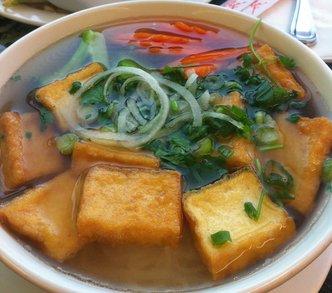

Title: Life long trip to vegetarianism
Date: 2015-11-03 00:00
Tags: ethics

My lifelong trip with being vegetarian has been met with constant setbacks. I clearly remember taking an Ethics class in college where I learned about the morality of eating (and using) animals and their by-products. There are many reasons for being a [vegetarian](https://en.wikipedia.org/wiki/Vegetarianism) (or vegan), but my main reason is compassion for animal life.

While I deeply believe in animal rights, becoming a vegetarian clashes with the culinary heritage of my culture. In Mexico, both traditional and foreign food are expected to include meat to be considered a full meal. Serving vegetarian food to a guest (probably except for breakfast) is considered rude. Tacos, tortas, burritos, etc., would not be the same without beef, pork or chicken. To complicate matters further, our strong social and family bonds make it difficult to accomodate for vegetarian diets: gatherings are planned with little to no advanced notice, and specific (meat based) dishes are expected depending on the special ocassion. Tamales for the holidays, tacos for after partying, etc. Spending additional money and time prepping a vegetarian meal for only one person is out of the question.

With a lack of will power to become a full time vegetarian, I've resorted to different strategies. I've tried the following.

## Vegetarian during weekdays

So far this has been the most successful strategy. In my mind, however, I feel like animals don't stop suffering when consumed during weekends.

## Vegatarian for all the meals that I cook

While this is very effective when I cook, I find that sometimes more than half of the meals of the week are prepared by others than me or my wife: eating out or gatherings with friends or family. I underestimated how often I eat food I did not cook.

## Vegetarian except for special occasions

While this sounds like a good strategy, we soon discovered that a "special occasion" was a broad term. Birthdates of friends and family are the obvious ones, but there are also the fútbol practice with nieces, visiting relatives, funerals, national holidays, celebrating accomplishments, and sometimes even weekends.

## Vegetarianism as a life long trip

While I've tried and failed to become a full time vegetarian for a long time, I have nonetheless succeeded in:

- Being informed and convinced on why I think vegetarianism is the only moral choice
- Eating meat way less frequently than I did five years ago
- Sharing my experience with those around me. I've found that with time, more and more people around me share the same utopian vision as I do, and are more open to exploring going vegetarian for at least one meal a day
- Incorporating vegetarian dishes to my weekly meals, and sharing these with others
- Discovering vegetarian asian food and loving it
